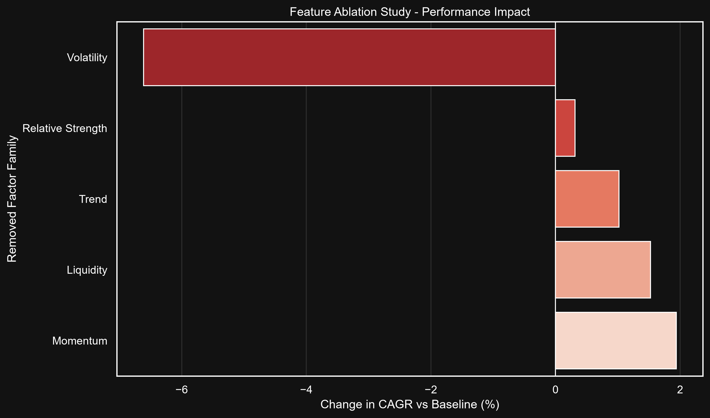

# TEST 14: Feature Ablation Study

| Removed Family | CAGR | Sharpe | CAGR Change | Sharpe Change |
|----------------|------|--------|-------------|---------------|
| Momentum | 26.75% | 1.16 | +1.94% | +0.08 |
| Trend | 25.83% | 1.10 | +1.02% | +0.03 |
| Relative Strength | 25.13% | 1.08 | +0.31% | +0.01 |
| Liquidity | 26.34% | 1.09 | +1.52% | +0.02 |
| Volatility | 18.20% | 0.79 | -6.61% | -0.28 |

