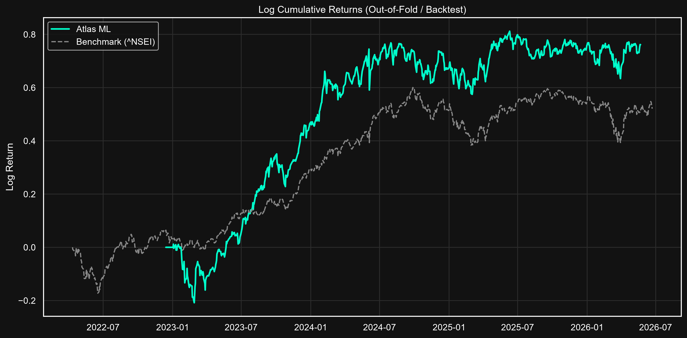

# Atlas Phase 4.2: Institutional Validation & Reality Check

**Generated:** 2026-06-23
**Overall Verdict:** FAIL

## Atlas Validation Scorecard
| Test | Status |
|------|--------|
| Leakage Audit | PASS |
| Permutation Test | FAIL |
| Random Baseline | PASS |
| Mean Baseline | PASS |
| Momentum Baseline | FAIL |
| Decile Analysis | PASS |
| Confidence Analysis | PASS |
| Unseen Stock Holdout | PASS |
| Out-of-Time Validation | PASS |
| Feature Stability | PASS |
| Transaction Cost Stress Test | PASS |
| Monte Carlo Robustness Test | PASS |
| Feature Ablation Study | PASS |
| Strategy Capacity Analysis | PASS |

## Final Reality Score
| Category | Score |
|-----------|---------|
| Leakage Safety | X/10 |
... (See detailed score logic)
**Total Atlas Reality Score: 30/50**
**Grade: D**

## Visualizations

